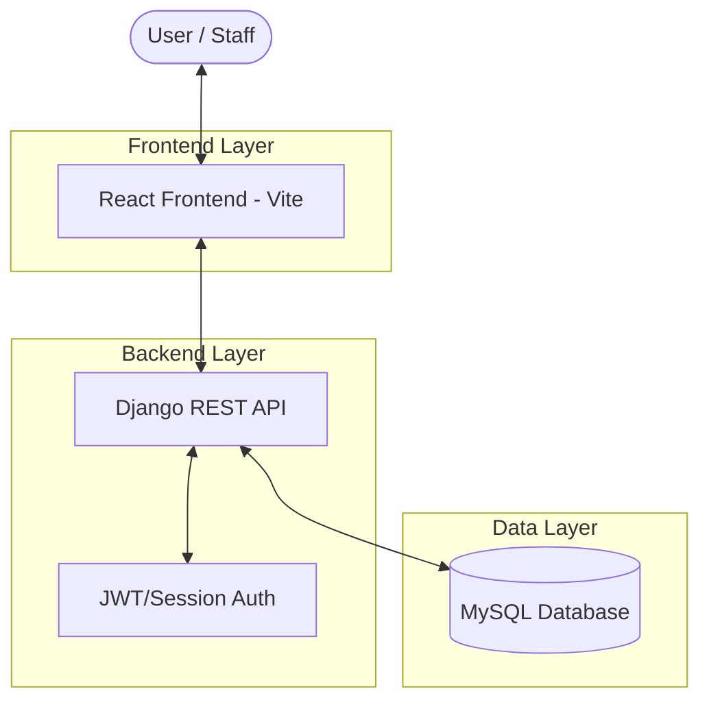

# ProGarage - Garage Management System

[](https://www.djangoproject.com/)
[](https://reactjs.org)
[](https://mysql.com)
[](https://tailwindcss.com)

ProGarage is a comprehensive **Garage Customer and Vehicle Information Management System** designed to streamline garage operations. It provides a robust platform for managing customer records, vehicle information, service histories, billing, and staff workflows.

---

## 🚀 Quick Start

### Prerequisites
- Python 3.10+
- Node.js 18+
- MySQL/MariaDB (XAMPP recommended)

### Installation Steps

#### 1. Clone Repository
```bash
git clone <repository-url>
cd Garage_Customer_and_Vehicle_Information_Management_System
```

#### 2. Database Setup
```bash
# Start MySQL (via XAMPP or service)
# Open MySQL client and run:
CREATE DATABASE garage_db CHARACTER SET utf8mb4 COLLATE utf8mb4_unicode_ci;

# Import the SQL file
mysql -u root -p garage_db < garage_db.sql
```

#### 3. Backend Setup
```bash
cd backend

# Create virtual environment
python -m venv .venv

# Activate virtual environment
# Windows:
.venv\Scripts\activate
# Linux/Mac:
source .venv/bin/activate

# Install dependencies
pip install django djangorestframework django-cors-headers mysql-connector-python

# Run migrations (creates Django system tables)
python manage.py migrate

# Start Django server
python manage.py runserver
```

Backend will run at: **http://localhost:8000**

#### 4. Frontend Setup
```bash
# Open new terminal
cd frontend

# Install dependencies
npm install

# Start development server
npm run dev
```

Frontend will run at: **http://localhost:5173**

### 🎯 Access the Application
Open your browser and go to: **http://localhost:5173**

---

## 🏗️ Project Architecture

The system follows a modern **Decoupled Architecture** with a clear separation between the frontend and backend.



---

## 🚀 Tech Stack

### Frontend
- **Framework**: [React](https://reactjs.org/) (via Vite)
- **Styling**: [Tailwind CSS](https://tailwindcss.com/)
- **Icons**: [Lucide React](https://lucide.dev/)
- **State Management**: React Context API
- **Routing**: React Router DOM

### Backend
- **Framework**: [Django](https://www.djangoproject.com/)
- **API**: [Django REST Framework](https://www.django-rest-framework.org/)
- **Database**: [MySQL](https://www.mysql.com/) (XAMPP/Direct)
- **Authentication**: Custom Session/Role-based approval

---

## ✨ Key Features

- **👤 Customer Management**: Comprehensive tracking of customer details, contact info, and linked vehicles.
- **🚗 Vehicle Tracking**: Manage vehicle models, brands, registration numbers, and service history.
- **🛠️ Service Management**: Complete lifecycle of vehicle services, from pending to completed, with technician assignments.
- **🧾 Billing & Invoicing**: Automated invoice generation, tax calculation, and payment status tracking.
- **👥 Staff Workflow**: Role-based access (Admin/Staff) with a registration approval system.
- **📊 Real-time Dashboard**: Overview of recent activities, service status, and management metrics.

---

## 📁 Project Structure

```text
.
├── backend/                # Django Backend
│   ├── garage_backend/     # Project Settings & URLs
│   ├── service_history/    # Core App (Models, Views, Serializers)
│   ├── accounts/           # User Authentication App
│   ├── utils/              # Helper utilities
│   └── manage.py           # Django CLI
├── frontend/               # React Frontend
│   ├── src/
│   │   ├── components/     # Reusable UI Elements
│   │   ├── context/        # Global State Management
│   │   ├── pages/          # Full Page Views (Admin/Staff)
│   │   └── services/       # API Integration
│   ├── package.json        # Dependencies
│   └── vite.config.js      # Vite Settings
└── garage_db.sql           # Database Schema with Sample Data
```

---

## ⚙️ Daily Development

### Start Backend
```bash
cd backend
.venv\Scripts\activate    # Windows
# or: source .venv/bin/activate  # Linux/Mac
python manage.py runserver
```

### Start Frontend
```bash
cd frontend
npm run dev
```

---

## 🔐 User Roles

| Role | Permissions |
| :--- | :--- |
| **Admin** | Full system access, approve new staff, delete records, view all billing. |
| **Staff** | Create/Update customers, vehicles, and services; view dashboard. |

---

## 📜 License
This project is for educational and management purposes. All rights reserved.

---

## 📞 Contact & Support

For issues, questions, or contributions, please open an issue on the repository.

**Note:** Make sure to change the `SECRET_KEY` in `backend/garage_backend/settings.py` before deploying to production!
