# 🔧 ProGarage - Advanced Garage Management System

[](https://www.djangoproject.com/)
[](https://reactjs.org)
[](https://mysql.com)
[](https://tailwindcss.com)
[](LICENSE)

**ProGarage** is a professional-grade, full-stack application designed to digitize and automate the operations of modern automotive service centers. It offers a seamless workflow from vehicle reception to final invoicing, ensuring efficiency and financial accuracy.


*(Replace this link with an actual screenshot of your dashboard)*

---

## 🚀 Key Features

### � Customer & Vehicle Management
- **Centralized Database**: Store comprehensive customer profiles including NIC, contact details, and address.
- **Vehicle Profiles**: Link multiple vehicles to a single customer with details like Brand, Model, Year, VIN/Plate Number, Fuel Type, and Mileage.
- **History Tracking**: instant access to a vehicle's entire service history.

### 🛠️ Service Workflow Automation
- **Job Cards**: Create service records with detailed descriptions, estimated hours, and cost projections.
- **Status Tracking**: Monitor jobs through customizable stages:
  - ⏳ **Pending**: Job created, waiting for start.
  - ⚙️ **In Progress**: Technician assigned and working.
  - ✅ **Completed**: Job finished, ready for billing.
- **Technician Assignment**: Allocate jobs to specific technicians based on workload and specialization.

### 💰 Billing & Financial Control
- **Smart Invoicing**: Automatically generate invoices from completed service records.
  - **Tax Calculation**: Configurable global tax rates.
  - **Discounts**: Apply manual discounts directly on the invoice.
  - **Advance Payments**: Handle deposits and partial payments with ease.
- **Customer Statements**: Generate detailed financial statements showing all invoices, payments, and outstanding balances for any customer.
- **Payment Tracking**: Record payments via Cash, Card, Cheque, or Bank Transfer.
- **PDF Export**: Generate professional PDF invoices and reports instantly using `jsPDF` and `html2canvas`.

### 🔐 Security & Administration
- **Role-Based Access Control (RBAC)**:
  - 🛡️ **Admin Portal**: Full system control, staff approval, financial reports, and settings management.
  - 👷 **Staff Portal**: Focused interface for daily operations (bookings, updates) without sensitive administrative access.
- **Staff Approval**: Strict "Approve-to-Access" workflow for new staff registrations.

### 📊 Analytics & Reporting
- **Dynamic Dashboards**: Interactive charts using `Recharts` to visualize:
  - Monthly Revenue Trends
  - Service Status Distribution
  - Technician Performance
- **Exportable Reports**: Download financial and operational data for offline analysis.

---

## 🏗️ Technical Architecture

The system is built on a **Decoupled Architecture**, ensuring the frontend and backend can evolve independently.

```mermaid
graph TD
    User([🖥️ Client Browser]) <-->|JSON / REST API| API[⚙️ Django REST Framework]
    API <-->|Query| DB[(🗄️ MySQL Database)]
    
    subgraph "Frontend Layer"
        React[React + Vite]
        Tailwind[Tailwind CSS]
        State[Context API]
    end

    subgraph "Backend Layer"
        Django[Django Core]
        Serializer[Serializers]
        Auth[JWT / Session Auth]
    end
```



### 💻 Technology Stack

| Domain | Technolgies |
| :--- | :--- |
| **Frontend** | **React 18** (Vite), **Tailwind CSS**, `Lucide React` (Icons), `Recharts` (Charts), `Axios`, `jsPDF`, `html2canvas` |
| **Backend** | **Python 3.10+**, **Django 5.0**, **Django REST Framework (DRF)**, `mysql-connector-python` |
| **Database** | **MySQL 8.0** (XAMPP recommended) |
| **Dev Tools** | Git, VS Code, Postman |

---

## ⚙️ Installation Guide

Follow these steps to deploy ProGarage locally.

### 1. Prerequisites
- **Python** 3.10 or higher
- **Node.js** 18 or higher
- **MySQL** (via XAMPP or standalone installation)

### 2. Database Configuration
1. Start your MySQL Server (e.g., via XAMPP Control Panel).
2. Create the empty database:
   ```sql
   CREATE DATABASE garage_db CHARACTER SET utf8mb4 COLLATE utf8mb4_unicode_ci;
   ```
3. (Optional) If you have the `garage_db.sql` file, import it to seed data:
   ```bash
   mysql -u root -p garage_db < garage_db.sql
   ```

### 3. Backend Setup
```bash
# 1. Navigate to backend directory
cd backend

# 2. Create virtual environment
python -m venv .venv

# 3. Activate virtual environment
# Windows:
.venv\Scripts\activate
# Mac/Linux:
source .venv/bin/activate

# 4. Install dependencies
pip install -r requirements.txt
# If requirements.txt is missing, run:
# pip install django djangorestframework django-cors-headers mysql-connector-python

# 5. Run Database Migrations
python manage.py migrate

# 6. Start the Server
python manage.py runserver
```
✅ Backend running at `http://127.0.0.1:8000`

### 4. Frontend Setup
```bash
# Open a new terminal
# 1. Navigate to frontend directory
cd frontend

# 2. Install Node dependencies
npm install

# 3. Start Development Server
npm run dev
```
✅ Frontend running at `http://localhost:5173`

---

## 📸 Screen Gallery

| Login Portal | Admin Dashboard |
| :---: | :---: |
|  |  |

| Service Tracking | Invoice Generation |
| :---: | :---: |
|  |  |

---

## 🤝 Contributing & License

This project is intended for educational and portfolio purposes.

- **License**: MIT License (See `LICENSE` file)
- **Support**: For issues, please create a GitHub Issue.

### Credits
- Developed by **Sivatheevan**
- Icons by [Lucide](https://lucide.dev/)
